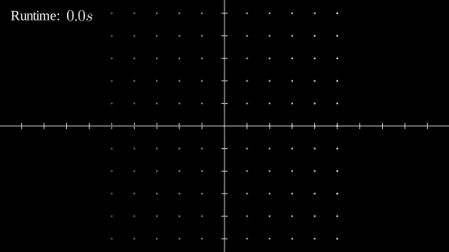

# Simulate and display movement of particles in a system

A toy project to simulate and display movements of particles in a
system (e.g. fishes in a school, or birds in a flock) using
mathematical notations, `numpy`/`scipy` and `manim`.

  

